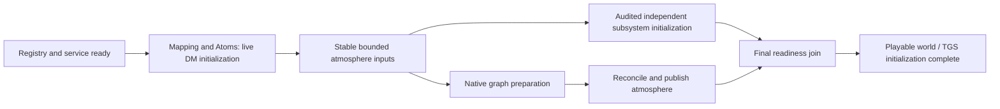

# Atmosphere startup preparation design

Status: proposed design for review, 2026-09-14. This is the startup workstream of the [roadmap](../../performance/2026-09-14-atmosphere-roadmap.md), separate from runtime tick isolation. N/G and their exact source anchors are defined in the roadmap.

## Outcome and scope

Reduce process-start-to-playable-readiness time by removing repeated boundary calls and overlapping pure native preparation with independent initialization. Move deterministic repeatable inputs into an optional build artifact only if profiling shows a material remaining cost.

Compilation cannot create the final live DM world, handles, or runtime-generated topology. Build preparation produces portable data. Runtime reconciles actual turf/machinery state and must complete a readiness barrier before play. This design does not persist a running service across rounds or serialize a complete DreamDaemon process.

## Current anchors

| G source | Observation |
| --- | --- |
| `modular_aphelion/modules/dogmos/code/dogmos.dm`, `SSdogmos.Initialize` | Registry/service readiness precedes Mapping and Atoms because constructors already use gas APIs |
| `code/modules/atmospherics/gasmixtures/gas_mixture.dm`, `New` | Mixture registration occurs synchronously during construction |
| `code/controllers/subsystem/air.dm`, `parse_gas_string` | Canonical recipes are cached already; ordinary mutable users receive copies |
| `air.dm`, `setup_allturfs` | Main atmosphere setup already batches registration and snapshot reads |
| `air.dm`, `StopLoadingMap` | Catch-up loop registers and activates queued turfs without establishing its own batch owner |
| `air.dm`, `setup_allturfs` difference pass | Startup compares adjacent gas and resolves active regions before finishing |
| `code/controllers/master.dm`, `Initialize` | Dependency sorting exists, but subsystem initialization calls are executed serially |

During the later R1 focused qualification, local Library Loading spent about 133 seconds while database connections failed; Atmospherics then initialized in roughly 18 seconds. These test boots are not controlled timing cohorts. `SSlibrary.load_shelves()` already dispatches shelf callbacks asynchronously and joins them through `callback_select`; each shelf can request multiple random-book categories. This is a concrete reminder that asynchronous dispatch alone does not shorten the readiness barrier. Keep database availability, library work and atmosphere preparation separately attributable when evaluating this startup design. A library connection-failure policy would be a separate change; none is implemented here. See the [execution evidence](../../performance/2026-09-14-workplan-execution.md).

## Global constraints

- Rust 1.98.0 with `--locked`; BYOND 516.1687 for the anchored game; revalidate pins before execution.
- No subagents. Preserve unrelated work. No commits or production operations without the applicable authorization.
- Preserve public constructor behavior, gas values, temperature/volume rules, immutable mixtures, subtype hooks, turf order, multiz edges, and critical events.
- Keep map-sized native state and preparation scratch in the 64-bit service; keep shim and transient DM batches bounded.
- Do not change physics or mark the world playable before atmosphere and its dependent machinery are ready.
- Generated bindings and manifests are regenerated only with maintained tools.

## S1: Batch the existing late-map catch-up loop

Wrap only the synchronous `StopLoadingMap` registration/activation loop in the existing `runtime_topology_batching` ownership mechanism. Save and restore the previous owner flag on success and exception. Preserve `map_loading`, queue order, per-turf registration then activation order, and queue clearing behavior. Existing 512-record capacity flushes remain active.

If this scope is the outermost owner, flush its accepted prefix on normal completion and before propagating a loop failure, matching the visibility of work completed before failure. A frozen native frontier still defers topology through the existing queue; do not force a flush through it. Never blanket-wrap all `Initialize`/`LateInitialize` in a batching flag: those paths may yield, read atmosphere immediately, or invoke unrelated hooks.

For N fresh gas-and-heat registrations with no existing owner, no extra topology work, and no pending stage, the focused request-count oracle is `2 * ceil(N / 512)` lifecycle/heat calls rather than `2 * N`. This is a fixture-specific count, not a whole-startup prediction. Test N=1, 512, and 513 and exact identity/full heat fields, nesting, failure prefixes, and frozen frontiers.

## S2: An explicit bulk mixture factory

Introduce a dedicated `CreateFromSourceBatch` operation using the current atomic single-copy semantics. Each fixed 32-byte record contains destination slot/generation, source slot/generation, requested volume f64, flags u32=0, and reserved u32=0. An 8-byte header contains record count and reserved u32=0. Admit 1-512 records; reject duplicate destinations, invalid/stale handles, nonfinite or negative narrowed volumes, and unknown sources before publication. Reserve all needed capacity before making any destination visible. The entire batch succeeds or none of it does.

Proposed unused operation ID is 53 at the anchor, following runtime job operations 49-52. Integrate with the next protocol version and full paired artifact generation; do not assign competing version numbers in separate branches. Existing single `CreateFromSource` and all public constructors remain supported.

The game factory `SSdogmos.create_map_mixture_batch(recipes)` consumes an ordered bounded list of `(exact mixture type, source, volume)` descriptors. It reserves handles, asks the service to create the batch, then constructs and attaches DM datums through single-use internal receipts for those already accepted handles. A receipt is valid only for that factory scope, exact type/source/volume, slot/generation, and one attachment. Existing constructors receive no implicit global deferred mode. Restrict initial eligibility to the exact base mixture type; any subtype needs a separate proof that its constructor/hooks remain equivalent.

If service admission fails, release every reserved DM slot without exposing a datum. If DM construction fails after service acceptance, keep the already attached prefix under normal caller ownership and unregister all unattached destinations; preserve the original error. No orphan accepted handles or receipt table survives scope cleanup. Bound the receipt table to 512 entries.

This API is a preparation mechanism, not permission to move turf air assignment earlier. Before integrating a map caller, inspect the entire call sequence for reads, signals, subtype constructors, neighbor observations, mutation, and yielding. Inputs must be independent and fixed for the batch. Attach datums and publish `turf.air` in the original observable order. The first integration is permitted only where a transcript proves this; otherwise retain the synchronous caller and report the factory as an unintegrated prototype. Do not claim startup savings from a standalone batch benchmark.

## S3: Start, prepare, then join native initialization

Reuse the runtime design's single service owner and explicit publication model. Split startup readiness into named milestones:

Registry/service readiness remains before the first gas constructor. Starting the service earlier can overlap executable verification and launch only with work that does not need it; it cannot bypass the contract check. The larger overlap begins only after the needed DM inputs are stable. DM traversal and arbitrary atom initialization remain on the main thread.

Add a reusable opt-in preparation contract to the MC rather than marking `SSair.initialized` early. Proposed subsystem API: `BeginInitializationPreparation()` returns a token or null; `PollInitializationPreparation(token)` returns Running/Ready/Failed without expensive work; `FinishInitializationPreparation(token)` performs the validated join. Default implementations opt out. Existing `Initialize()` remains the public full-readiness contract and synchronous path.

The MC may run only dependency-ready work between Begin and Finish. Preserve init stages, normal dependency ordering, error reporting, initialization signals, timer ownership, and TGS readiness. Initially allow one asynchronous subsystem preparation, SSair. The executor must identify candidate independent subsystems from actual reads/writes, not merely absence from a declared dependency list. If none is safe, preparation can improve responsiveness but cannot claim wall-time overlap savings.

Changes to captured turfs while native preparation runs carry generation/revision invalidation. Keep a bounded dirty journal; overflow triggers a bounded reconciliation before publication. A replaced turf's result cannot attach to the replacement generation. Immediate gas reads remain committed/coherent. Never let an incomplete preparation satisfy a dependency. Stop any optional overlap if deterministic ordering cannot be preserved.

The final join completes native state, pending topology, required callbacks, pipenet/machinery readiness, and required visual state. Optional diagnostic presentation can be deferred only through a separate measured change; the current small Kennel overlay setup is not presumed a significant cost. TGS initialization complete and player-ready markers remain after this join.

## S4: Optional deterministic build artifact

The first artifact contains a validated numeric recipe catalog, deterministic type/map descriptors, and capacity hints. It does not contain DM references, slot/generation handles, mutable mixtures, random-ruin placement, or an assumed final world graph. Precomputed static candidate edges are a later extension only after exact runtime reconciliation is proven.

Generate the catalog from the same game definitions/evaluator used at runtime in an isolated build preparation environment. Do not maintain a second handwritten parser for DM inheritance, macros, or atmosphere generation. Dynamic/configuration-dependent entries stay runtime-generated and are explicitly marked ineligible for the artifact. A small isolated export world can run after compilation if required; its output is build data, not a live-world checkpoint. Its build cost must be reported separately from restart savings.

Artifact layout: magic `DOGATM01`, schema u32=1, reserved u32=0, descriptor count u32, recipe count u32, payload bytes u64, 32-byte payload SHA-256, followed by explicitly encoded records. Its companion generated manifest fingerprints game source/build defines, relevant map/template hashes, configuration inputs, gas/reaction registry order and values, native ABI/protocol/features, schema, and payload hash. Resource lengths and counts are checked before allocation; no arbitrary path, executable content, or native-memory serialization is loaded.

Schema 1 orders recipes by stable exported ID and descriptors by UTF-8 type path. A recipe is `id u32, flags u32=0, volume f64, temperature f64, moles[32] f64` (280 bytes); gas slots use the fingerprinted registry order. A descriptor is `path_bytes u32, flags u32, recipe_id u32, reserved u32=0`, followed by exactly `path_bytes` UTF-8 bytes with no padding. Flag bit 0 marks a dynamic/ineligible entry, which uses recipe ID `0xffffffff`; all other bits are zero. Duplicate IDs/paths, invalid UTF-8, absent referenced recipes, trailing bytes, and nonfinite/negative physical fields reject the artifact. The exporter preserves runtime evaluation and narrowing semantics; it does not invent higher-precision atmosphere values. Schema 1 contains type defaults and capacity hints in the manifest, not coordinate-level candidate edges.

A fingerprint or payload mismatch means the optional artifact is rejected before world registration and the ordinary startup path runs. This is a pre-world cache miss, not mid-round recovery from service loss. A valid load uses fresh service ownership and runtime handles. Artifact absent, rejected, and accepted paths must produce the same initialized world/events under the same seed. The runtime readiness barrier is unchanged.

Extend maintained build/release tooling only after the S4 entry gate: measured repeated parsing/derivation/IPC cost remains after S1-S3 and exceeds artifact validation/load/reconciliation cost. Publish the cache with the same deployment identity controls as other inputs; a native pair mismatch remains fatal even if cache fallback is allowed.

## Map authoring work

Use startup's existing difference report to identify unintended pressure, temperature, or composition seams. Add a build/test report that reproduces the runtime comparison predicate and identifies affected coordinates and initial-gas definitions. Do not automatically normalize map atmosphere or pre-equalize intentional boundaries. A mapping correction requires its own reviewed content change and equivalence expectations.

## Qualification and boundaries

The [startup work plan](../plans/2026-09-14-atmosphere-startup-preparation.md) defines separate delivery gates. Compare full readiness, Mapping, Atoms, Atmos, service preparation, and join time with identical maps/seeds/settings; include default and cold cache cases. Three controls and three candidates are the minimum. Previous noisy local timings are not a performance baseline.

S1 is ready for a focused implementation candidate. S2's native/factory contract is designed, while map integration is gated by an observable-constructor transcript. S3 requires a proven independent-work inventory. S4 requires a measured break-even case and authoritative extraction. These are explicit prerequisites, not permission to guess at hidden initialization dependencies.
